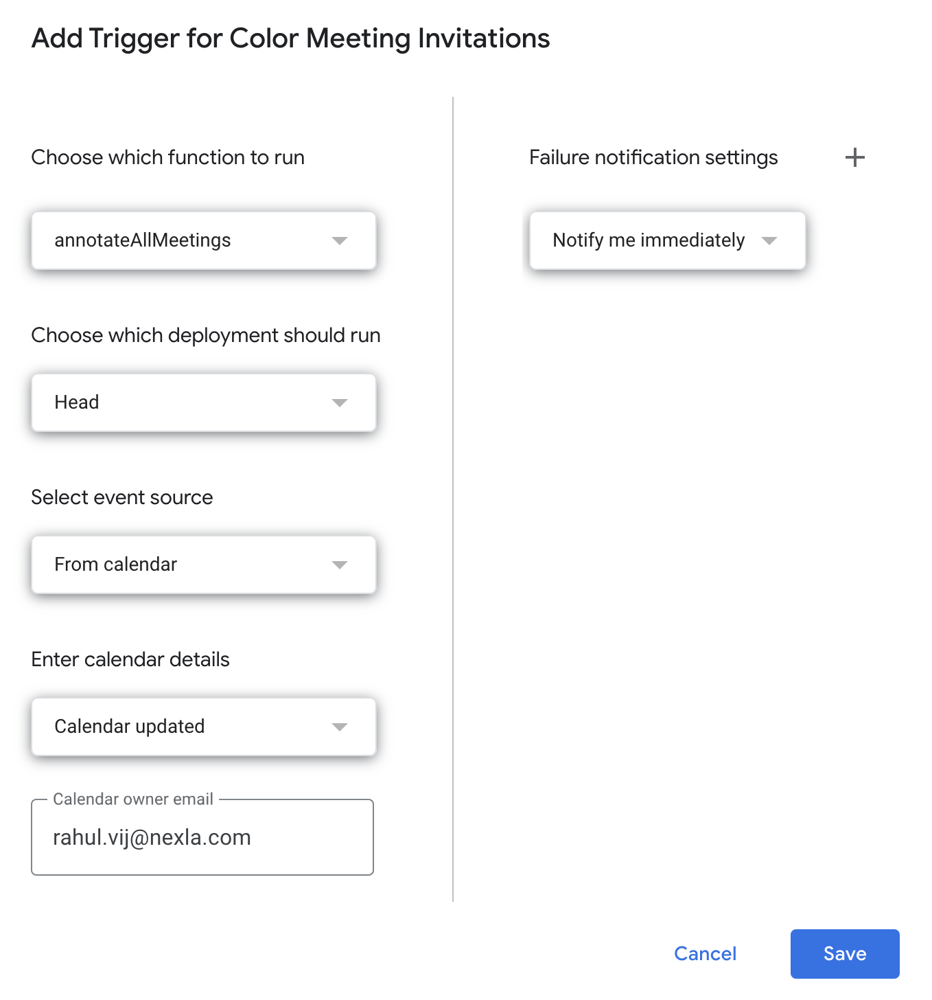
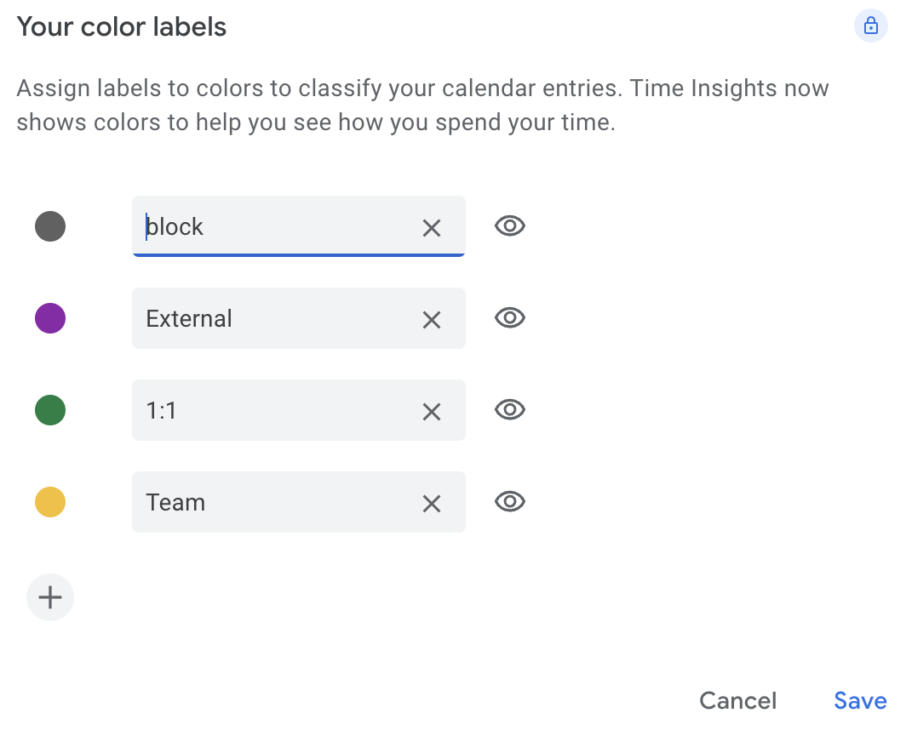

# gcal_color
Auto color google calendar events

In order to automatically color the events as soon as a new event is created. You follow these steps :

1. Deploy this script in code.js your google app script environment. By creating a new project and copy pasting the code there.
2. Rename the domain name on line 23 to your own company domain 'const domainName = "example.com";' 
3. Add more email IDs to the array on line 26. These are all the emails that can be on the invie but still considred as part of the team & not an external attendee
4. Add a trigger to the app script

5. Add the following color labels in your calendar

That's It.

If your internal meetings are colored as External : do these steps
1. Turn on dryrun on line2 and look at the output. 
2. Run the script and copy the output to a txt file. 
3. Search for the meeting name that was wrongly colored
3. Find and ddd these big email IDs like c_188dno8hkhd1oivwiduhwdn76n9s6@resource.calendar.google.com to the array on line 26, these are meeting rooms. acting like external attendeed
4. Identify bots - AI, notetakers, meeting records etc. acting like external attendees & add them to the array
5. Turn off dryrun & Run the script again.
6. Repeat 1-6 if for meetings that still wrongly tagged.

